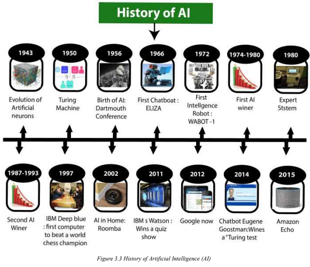

<!-- Lesson 3: Artificial Intelligence -->

## defined as "man-made"

artificial

## defined as "thinking power"

intelligence

## defined as a "man-made thinking power"

artificial intelligence

## ability to acquire and apply knowledge

intelligence

## intelligence is composed of:

- reasoning
- learning
- problem solving
- perception
- linguistic intelligence

## anything that can perceive its environment and act upon it

agent

## must be able to set goals and achieve them

intelligent agent

## the ability to use input from sensors (such as cameras, microphones, sensors, etc.) to deduce aspects of the world.

machine perception

## list high-profile examples of AI (at least 5)

- autonomous vehicles
- medical diagnosis
- creating art
- proving mathematical theorems
- playing games
- search engines
- online assistants
- image recognition
- spam filtering
- prediction of judicial decisions
- targeted online advertisements

## the study of computer algorithms that improve automatically through experience

machine learning

## The term machine learning was introduced by ____

Arthur Samuel (1959)

## are biologically inspired networks that extract features from the data in a hierarchical fashion.

neural networks

## The field of neural networks with several hidden layers is called ____

deep learning

## Artificial Intelligence requires the following disciplines:

- Mathematics
- Biology
- Psychology
- Sociology
- Computer Science
- Neurons Study
- Statistics

## Some main advantages of Artificial Intelligence:

- high accuracy with fewer errors
- high-speed
- high reliability
- useful for risky areas
- digital assistant
- useful as a public utility

## AI machines or systems are prone to fewer errors and high accuracy as it takes decisions as per pre-experience or information.

- high accuracy with fewer errors

## AI systems can be of very high-speed and fast-decision making, because of that AI systems can beat a chess champion in the Chess game.

- high-speed

## AI machines are highly reliable and can perform the same action multiple times with high accuracy.

- high reliability

## AI machines can be helpful in situations such as defusing a bomb, exploring the ocean floor, where to employ a human can be risky.

- useful for risky areas

## AI can be very useful to provide digital assistant to users such as AI technology is currently used by various E-commerce websites to show the products as per customer requirements.

- digital assistant

## AI can be very useful for public utilities such as a selfdriving car which can make our journey safer and hassle-free, facial recognition for security purposes, etc.

- useful as a public utility

## Disadvantages of AI:

- high cost
- can't think out of the box
- no feelings or emotions
- increaseed dependece on machines
- no original creativity

## BONUS: History of AI

## timeline: 1943

- evolution of artifical neurons

## timeline: 1950

- turing machine

## timeline: 1956

- birth of AI: Dartmouth Conference

## timeline: 1966

- first chatbot: ELIZA

## timeline: 1972

- first intelligent robot: WABOT-1

## timeline: 1974-1980

- first AI winter

## timeline: 1980

- expert system

## timeline: 1987-1993

- second AI winter

## timeline: 1997

- IBM Deep Blue: first to beat a world chess champion

## timeline: 2002

- AI in Home: Roomba

## timeline: 2011

- IBM Watson: Wins quiz show

## timeline: 2012

- Google Now

## timeline: 2014

- Chatbot Eugene Goostman wins Turing test

## timeline: 2015

- Amazon Echo

## timeline: 1943-1952

Maturation of Artificial Intelligence

## timeline: Maturation of Artificial Intelligence

1943-1952

## The first work which is now recognized as AI was done by ____

Warren McCulloch and Walter Pits (1943)

## He demonstrated an updating rule for modifying the connection strength between neurons.

Donald Hebb (1949)

## Donald Hebb demonstrated an updating rule for modifying the connection strength between neurons. His rule is now called ____

Hebbian learning (1949)

## ____ was an English mathematician and pioneered Machine learning in ____.

Alan Turing (1950)

## timeline: 1952-1956

Birth of Artificial Intelligence

## timeline: Birth of Artificial Intelligence

1952-1956

## ____ created the "first artificial intelligence program" named ____. This program had proved 38 of 52 Mathematics theorems, and find new and more elegant proofs for some theorems.

Allen Newell and Herbert A. Simon (1955) - Logic Theorist

## The word "Artificial Intelligence" first adopted by American Computer scientist ____ at the Dartmouth Conference.

John McCarthy (1956)

## timeline: 1956-1974

Golden Years - Early Enthusiasm

## ____ created the first chatbot in ____, which was named as ____.

Joseph Weizenbaum (1966) - ELIZA

## The first intelligent humanoid robot was built in ____ which was named ____.

Japan (1972) - WABOT-1

## refers to the time period where computer scientists dealt with a severe shortage of funding from the government for AI researches.

AI winter

## timeline: 1980-1987

Boom of AI

## timeline: Boom of AI

1980-1987

## ____ were programmed that emulate the decision-making ability of a human expert.

Expert Systems

## timelime: 1993-2011

Emergence of Intelligent Agents

## timeline: Emergence of Intelligent Agents

1993-2011

## ____ beats world chess champion, ____, becoming the first computer to beat a world chess champion.

IBM Deep Blue, Gary Kasparov (1997)

## for the first time, AI entered the home in the form of ____, a vacuum cleaner.

Roomba (2002)

## AI came into the Business world until the year ____. Companies like Facebook, Twitter, and Netflix also started using AI.

2006

## timeline: 2011-present

Deep learning, big data and artificial general intelligence

## timeline: Deep learning, big data and artificial general intelligence

2011-present

## In the year ____, ____ won jeopardy, a quiz show, where it had to solve complex questions as well as riddles.

2011, IBM's Watson

## Google has launched an Android app feature ____, which was able to provide information to the user as a prediction.

Google Now (2012)

## Chatbot ____ won a competition in the infamous "Turing test" during ____

Eugene Goostman (2014)

## The ____ from IBM debated on complex topics with two master debaters and also performed extremely well.

Project Debater (2018)

## Google has demonstrated an AI program called ____ which was a virtual assistant and which had taken hairdresser appointment on call, and the lady on the other side didn't notice that she was talking with the machine.

Duplex

## Levels of AI

- Stage 1: Rule-based Systems
- Stage 2: Context Awareness and Retention
- Stage 3: Domain-specific Expertise
- Stage 4: Reasoning Machines
- Stage 5: Self-aware Systems/Artificial General Intelligence (AGI)
- Stage 6: Artificial Superintelligence (ASI)
- Stage 7: Singularity and Trancendence

## The most common uses of AI today fit in this bracket, covering everything from business software (Robotic Process Automation) and domestic appliances to aircraft autopilots.

Stage 1: Rule-based Systems

## Algorithms that develop information about the specific domain they are being applied in. They are trained on the knowledge and experience of the best humans, and their knowledge base can be updated as new situations and queries arise. Well, known applications of this level are chatbots and “roboadvisors”.

Stage 2: Context Awareness and Retention

## Going beyond the capability of humans, these systems build up expertise in a specific context taking in massive volumes of information which they can use for decision making. Successful use cases have been seen in cancer diagnosis and the well-known Google Deepmind’s AlphaGo.

Stage 3: Domain-specific Expertise

## An example of a domain-specific AI is ____

Google Deepmind's AlphaGo

## These algorithms have some ability to attribute mental states to themselves and others – they have a sense of beliefs, intentions, knowledge, and how their own logic works. This means they could reason or negotiate with humans and other machines.

Stage 4: Reasoning Machines

## These systems have human-like intelligence – the most commonly portrayed AI in media – however, no such use is in evidence today.

Stage 5: Self-aware Systems/Artificial General Intelligence (AGI)

## AI algorithms can outsmart even the most intelligent humans in every domain. Logically it is difficult for humans to articulate what the capabilities might be, yet we would hope examples would include solving problems we have failed to so far, such as world hunger and dangerous environmental change.

Stage 6: Artificial Superintelligence (ASI)

## leads to a massive expansion in human capability. Human augmentation could connect our brains to each other and to a future successor of the current internet, creating a “hive mind” that shares ideas, solves problems collectively, and even gives others access to our dreams as observers or participants. Pushing this idea further, we might go beyond the limits of the human body and connect to other forms of intelligence on the planet – animals, plants, weather systems, and the natural environment.

Stage 7: Singularity and Trancendence

## Seven levels of AI maturity

1. Perception
2. Notification
3. Suggestion
4. Automation
5. Prediction
6. Prevention
7. Situational Awareness

## Artificial Intelligence Type-1: Based on Capabilities

- Weak/Narrow AI
- General AI
- Strong/Super AI

## Artificial Intelligence Type-2: Based on Functionality

- Reactive machines
- Limited memory
- Theory of Mind
- Self-awareness

## Layers of AI systems

- sensing layer
- interpretation layer
- interacting layer

## data is not contained in a regular database and is growing exponentially, making up most of the data in the world.

unstructured data

## system is a distributed file system that may run on a cluster of commodity machines, where the storage of data is distributed among the cluster and the processing is distributed too.

Hadoop File System

## ____ expose capabilities and services, enabling software components to communicate with each other easily.

Application Programming Interfaces (APIs)

## The goal of ____ is to extract knowledge or insights from data in various forms, either structured or unstructured, which is like data mining.

data science

## ____ provide users a tool kit to build intelligent applications. These platforms combine intelligent, decision-making algorithms with data, which enables developers to create a business solution.

artificial intelligence platforms