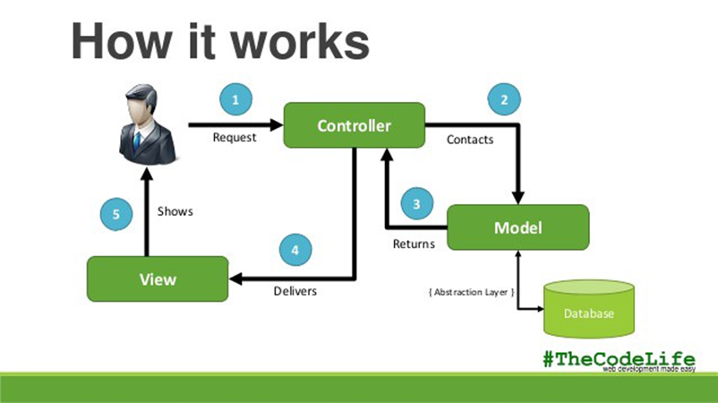

## A software design pattern which separates concerns of an application into the model, view, and controller

Model-View-Controller (MVC) pattern

## Benefits of using MVC frameworks

- separation of concerns
- reusability
- scalability
- maintainability
- community support
- security

## The MVC framework separates the application into three components - Model, View, and Controller. This separation allows developers to focus on specific tasks, such as database access, user interface design, and application logic, independently

- separation of concerns

## MVC frameworks provide a set of pre-built libraries, modules, and tools that can be reused across different projects. This saves developers time and effort by eliminating the need to write and test the same code multiple times.

- reusability

## MVC frameworks are designed to handle large, complex applications with ease. The modular architecture of MVC frameworks allows developers to add or remove functionality without affecting the rest of the application, making it easier to scale applications as needed.

- scalability

## MVC frameworks provide a clear structure for application code that is easy to maintain. By separating application logic into three distinct components, developers can easily update, modify, or fix any part of the application without affecting the rest of the system.

- maintainability

## Many popular MVC frameworks have large and active developer communities that contribute to the development, testing, and maintenance of the framework. This means that developers can rely on community support and resources to solve problems, share best practices, and learn new skills.

- community support

## MVC frameworks often provide built-in security features, such as input validation and authentication, that help developers ensure the safety and integrity of their applications.

- security

## Alternatives to MVC

- Model-View-Presenter (MVP)
- Model-View-ViewModel (MVVM)
- Hierarchical Model-View-Controller (HMVC)
- Frontend-centric architectures
- Domain-driven design (DDD)

## This pattern is similar to MVC but places more emphasis on the presentation layer. The Presenter acts as an intermediary between the Model and View and is responsible for handling user input and updating the View.

- Model-View-Presenter (MVP)

## This pattern is commonly used in client-side web development and is similar to MVP. The ViewModel acts as a mediator between the Model and View and provides data binding between the two.

- Model-View-ViewModel (MVVM)

# This pattern is an extension of the MVC pattern that is designed for large-scale applications. It allows for the creation of modular, reusable components that can be used across different parts of an application.

- Hierarchical Model-View-Controller (HMVC)

## Some modern frontend frameworks, such as React and Angular, use their own architectural patterns that focus on the frontend layer. These patterns often incorporate the concepts of MVC, such as separating concerns and creating reusable components, but with a different emphasis.

- Frontend-centric architectures

## This pattern focuses on building applications around the domain, or the business logic of the application. It emphasizes modeling the problem domain in the code and creating a flexible, maintainable architecture that can evolve with changing business needs.

- Domain-driven design (DDD)

## In the MVC pattern, it is responsible for managing the application's data and business logic.

Model

## In the MVC pattern, it interacts with the database and other data sources to retrieve and store data.

Model

## In the MVC pattern, it contains validation and processing logic for manipulating data.

Model

## In the MVC pattern, it acts as the backend and handles all data-related operations.

Model

## In the MVC pattern, it is responsible for presenting the user interface to the user.

View

## In the MVC pattern, it serves as the frontend and handles all user interface-relation operations. 

View

## In the MVC pattern, it sends input to the controller for processing. 

View

## In the MVC pattern, it is responsible for managing user requests and coordinating the Model and View.

Controller

## In the MVC pattern, it receives input from the View and processes it according to the Model.

Controller

## In the MVC pattern, it serves as the mediator between the Model and View.

Controller

## In the MVC pattern, it is responsible for updating the View with the latest data from the Model.

Controller

## Flow of data in MVC pattern

- User interacts through the View, which then sends input to the Controller
- Controller receives input, then communicates with Model to retrieve or store data
- Model retrieves/stores data, then returns the result to the Controller
- Controller updates the View with data from the Model
- View receives data from Controller, formats it, then shows it to the user

## tldr; Flow of data in MVC pattern

- user request to controller through view
- controller contacts model
- model queries database
- model returns result to controller
- controller delives data to view
- view shows information to user

## BONUS: How MVC Works

