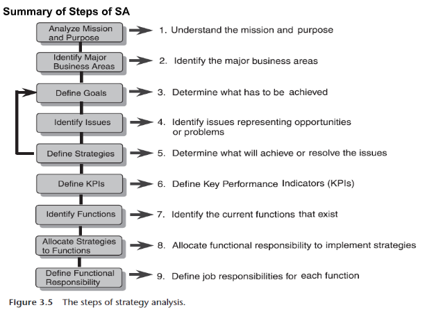

<!-- Module 3: Strategy Analysis -->

<!-- Lesson 1: Drucker's questions -->

## an evaluation of the working environment within an organization

strategic analysis

## list down Drucker's questions.

-  What is our business?
-  Who is the customer?
-  Where is the customer located?
-  What products or services does the customer want from us?
-  What does the customer consider as value?
-  What is the customer prepared to “pay”?
-  What will the business be, in the future?
-  What should the business be, in the future?
-  What is the key strategic thrust?

## how many steps in strategy analysis?

9

## strategy analysis step 1:

understand the mission and purpose

## strategy analysis step 2:

identify the major business areas

## strategy analysis step 3:

determine what has to be achieved

## strategy analysis step 4:

identify ussues representing opportunities or problems

## strategy analysis step 5:

determine what will achieve or resolve the issues

## strategy analysis step 6:

define key performance indicators (KPIs)

## strategy analysis step 7:

identify the current functions that exist

## strategy analysis step 8:

allocate functional responsibility to implement strategies

## strategy analysis step 9:

define job responsibilities for each function

## characteristics of goals and objectives

- measure
- level
- time

## characteristics of goals and objectives: this defines what performance indicator will be used for measurement

measure

## characteristics of goals and objectives: this indicates what result value must be achieved

level

## characteristics of goals and objectives: this specifies when that result should be achieved

time

## define SWOT

strengths, weaknesses, opportunities, threats

## performance measures must be ____

quantitative

## two parts of a performance measure

- result level
- time to achieve

## managers provide us with a list of the current functions:

- corporate
- finance
- forecasting
- marketing
- sales
- research and development
- production
- purchashing

## BONUS: strategy analysis summary

<!-- Lesson 2: Enterprise Architecture Methods -->

## 